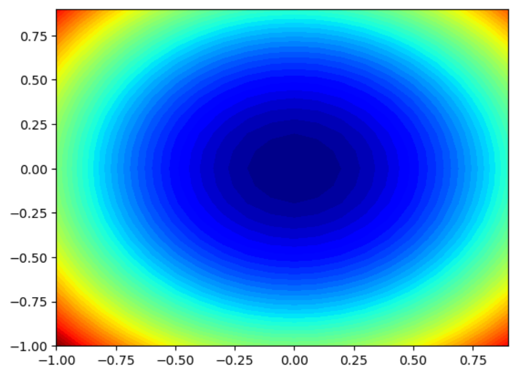
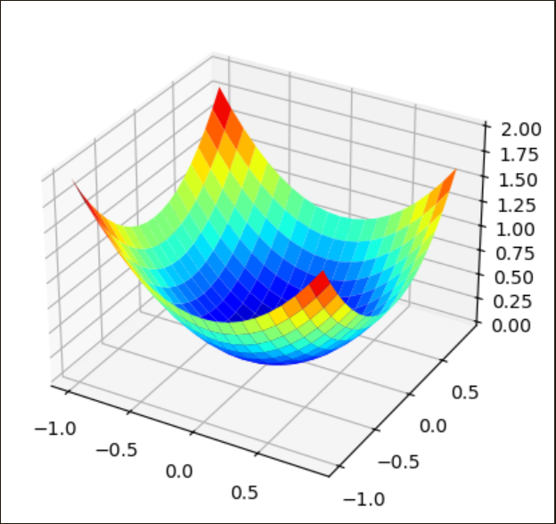
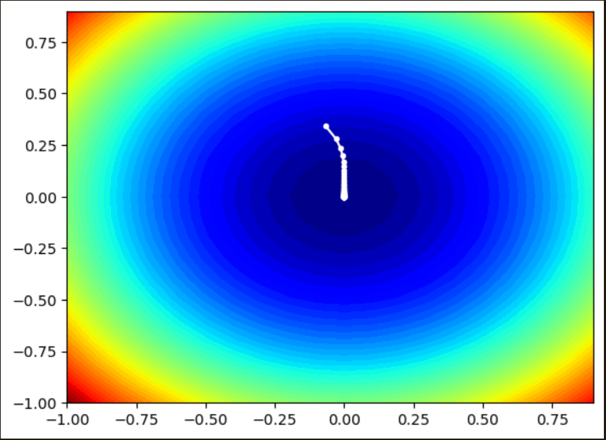
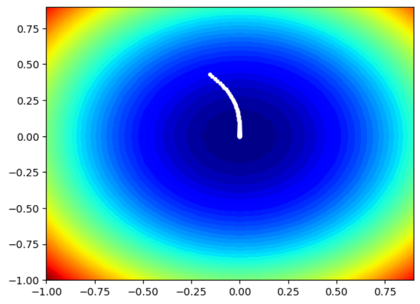

# Gradient Descent and Ascent Optimization

This project explores **optimization techniques** like **Gradient Descent**, **Gradient Ascent**, and the **Adagrad** optimizer. Implemented in Python using `NumPy` and `Matplotlib`, this notebook demonstrates how different optimization methods affect convergence using a 3D surface plot.

---

##  Overview

-  **Objective Function**: A simple quadratic function `f(x, y) = x² + y²`
-  **Optimization Methods**:  
  - Gradient Descent  
  - Gradient Ascent  
  - Adagrad Optimizer
-  **Visualization**: 3D surface plots using `matplotlib` to show learning paths

---

##  Algorithms Used

### 1. Gradient Descent
A method to minimize the objective function by moving in the direction of the steepest decrease.

### 2. Gradient Ascent
Used to maximize a function, moving in the direction of steepest increase.

### 3. Adagrad Optimizer
An adaptive learning rate optimizer that scales the learning rate based on historical gradients, helping with uneven frequency updates in parameters.

---

##  Visualization of Adagrad and Adadelta

---

## Key Learnings

- How optimizers behave in convex functions
- Visualizing convergence using 3D plots
- Implementation of Adagrad to overcome fixed learning rate issues

---

## Tools & Libraries

- Python 
- NumPy
- Matplotlib (3D plotting)

---

